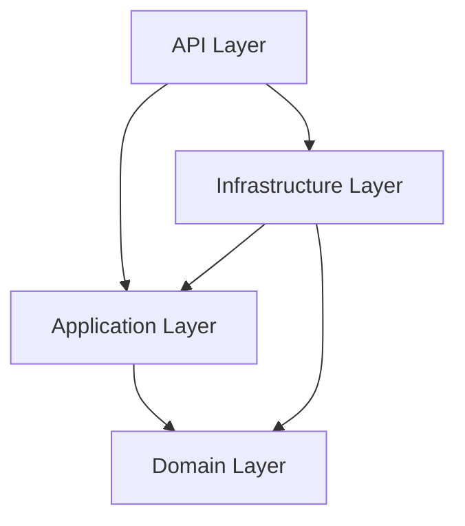

# VideoStreamCore 🎥

**High-Performance Video Streaming API** built with **.NET 9**, designed for scalability and maintainability using **Clean Architecture**.


---

## 🚀 Key Features (Tính Năng Nổi Bật)

- **🏗️ Clean Architecture**: Strict separation of concerns (Domain, Application, Infrastructure, API).
- **⚡ Smart Streaming (Hỗ trợ tua)**: Implements **Partial Content (206)** support for smooth video seeking.
- **🎬 Auto Metadata Processing**: Integrates with **FFmpeg** to automatically extract video **Duration** and generate **Thumbnails** upon upload.
- **💾 Hybrid Storage**: Configurable to use **MinIO (S3)** for object storage or **Local Storage**.
- **🗄️ SQL Server Database**: Uses Entity Framework Core with Code-First migrations.
- **🐳 Docker Ready**: (Optional) Can be easily containerized.

---

## 🏗️ System Architecture (Kiến Trúc Hệ Thống)

The solution is organized into 4 independent layers:

### 1. **Domain Layer** (Core)
- Contains business implementations: `Video`, `User`.
- Defines Enums and Shared Models.
- **No external dependencies**.

### 2. **Application Layer** (Logic)
- Defines Interfaces: `IVideoRepository`, `IVideoStorage`, `IVideoProcessor`.
- Contains DTOs (Data Transfer Objects) and Use Cases.
- **Depends on:** Domain.

### 3. **Infrastructure Layer** (Implementation)
- Implements Interfaces from Application Layer.
- **Data Access**: `VideoRepository` (EF Core).
- **Storage**: `MinioVideoStorage` (MinIO SDK).
- **Processing**: `FfmpegVideoProcessor` (Xabe.FFmpeg).
- **Depends on:** Domain, Application.

### 4. **API Layer** (Entry Point)
- RESTful API Controllers.
- Dependency Injection (DI) Configuration.
- Swagger UI Documentation.
- **Depends on:** Application, Infrastructure.



---

## ⚙️ Getting Started (Hướng Dẫn Cài Đặt)

### Prerequisites (Yêu Cầu)
- [.NET 9.0 SDK](https://dotnet.microsoft.com/download/dotnet/9.0)
- **SQL Server** (LocalDB or Express).
- **FFmpeg**: Download and verify path.
- **MinIO Server** (Optional for object storage).

### 📥 1. Clone & Configure
```bash
git clone https://github.com/your-username/VideoStreamCore.git
cd VideoStreamCore
```

**Update `appsettings.json`:**
```json
"ConnectionStrings": {
  "DefaultConnection": "Server=.\\SQLEXPRESS;Database=VSDB;Trusted_Connection=True;TrustServerCertificate=True;"
},
"Minio": {
  "Endpoint": "localhost:9000",
  "AccessKey": "minioadmin",
  "SecretKey": "minioadmin"
}
```

### 🗄️ 2. Database Migrations
Run the following commands to create the database:
```bash
dotnet ef database update --project VideoStreamCore.Infrastructure --startup-project VideoStreamCore.API
```

### ▶️ 3. Run the Application
```bash
dotnet run --project VideoStreamCore.API
```

Access Swagger UI at: `https://localhost:7038/swagger`

---

## 🧪 Usage Guide (Hướng Dẫn Sử Dụng)

### Upload Video
1.  Open Swagger UI.
2.  Use `POST /api/Videos/upload`.
3.  Upload a `.mp4` file.
4.  Response contains `streamUrl`.

### Stream Video
Use the returned `streamUrl` in any browser or HTML player:
```html
<video controls width="600">
    <source src="https://localhost:7038/api/Stream/{id}" type="video/mp4">
</video>
```

---
*Built with ❤️ by TunDuzz*